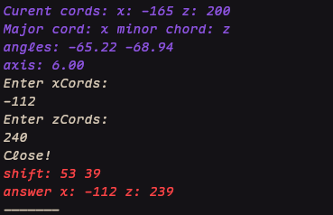

DEMO math practice for stronghold triangulation.

This is a CLI-only project, and there are no plans to add a GUI. 

This is using 2 chunk axis triangulation, specifically the one explained in <a herf="https://www.youtube.com/watch?v=OKJxB9ClPbo">this</a> video by Fineberg.

# Planned features:

- Rework how the info is generated for realistic scenarios. DONE

- ability to set the margin of error

- ability to set axis pressure

## Reach features:
- other triangulation methods (i.e., 4-sprint jump, distance estimation, etc.)

# installation/usage

Download/clone the repo.

cd to the repo

`cd /*REPLACE-WITH-PATH-TO-PROJECT*/AnglePrac`

Run it through your preferred terminal.

`./build/AP`

To stop use crtl-c, or any other termination signal
